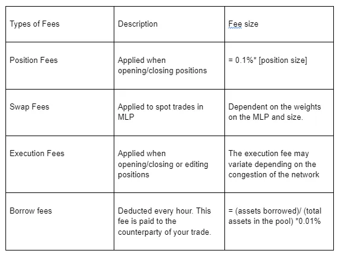

# 📈 Fees

Minerva collects fees in 4 different forms:

<figure><figcaption></figcaption></figure>

\-60% of the fees will go to MLP stakers.\
\-30% of the fees will go to Mine and allMine stakers.\
\-10% of the fees will go the treasury
