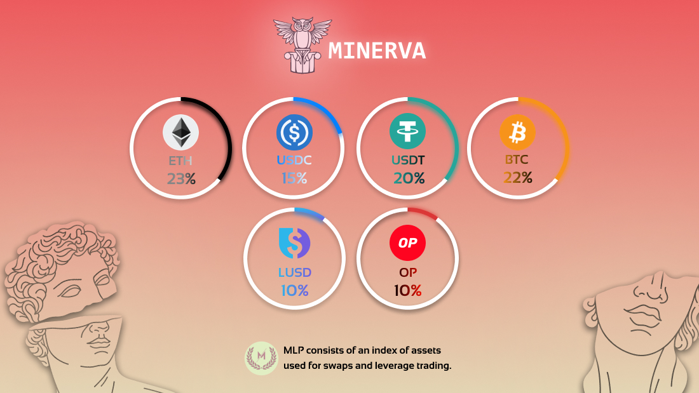

# 🟣 MLP

### Overview

MLP consists of an index of assets used for swaps and leverage trading. It can be minted using any index asset and burnt to redeem any index asset.

<figure><figcaption></figcaption></figure>


The price for minting and redemption is calculated based on (total worth of assets in index including profits and losses of open positions) / (MLP supply).


MLP holders earn Escrowed MINE rewards and 60% of platform fees distributed in ETH.


Note that the fees distributed are based on the number after deducting referral rewards and the network costs of keepers, keeper costs are usually around 1% of the total fees.


Staked MLP token address:\
\
As MLP holders provide liquidity for leverage trading, they will make a profit when leverage traders make a loss and vice versa.

### Minting and Redeeming

#### Minting MLP

Bridge any of the MLP tokens to Optimism, a list of MLP tokens can be found on the Dashboard.\
\
Fees for buying MLP will vary based on which assets the index has less or more of, the Buy MLP page will show which assets have the lowest fee.\
\
After buying your tokens will automatically be staked and you will start earning Escrowed MINE (allMINE) and ETH rewards, you can check your rewards at [https://minerva.money/](https://minerva.money/)

#### Redeeming MLP

Key in the amount of MLP you'd like to redeem at [https://minerva.money/#/buy\_mlp#redeem](https://minerva.money/#/buy\_mlp#redeem).

#### Token Pricing

There may be a spread on some tokens, minting MLP will be based on the lower value of the token and redeeming MLP will be based on the higher value of the token.\
\
For stablecoin tokens, the spread will be from the Chainlink price of the stablecoin to 1 USD.\
\
The price of MLP will depend on the spread of the tokens in the pool as well.

#### Rebalancing

The fees to mint MLP, burn MLP or to perform swaps will vary based on whether the action improves the balance of assets or reduces it. For example, if the index has a large percentage of ETH and a small percentage of USDC, actions which further increase the amount of ETH the index has will have a high fee while actions which reduces the amount of ETH the index has will have a low fee.\
\
The token weights can be seen on the Dashboard.\
\
Token weights are adjusted to help hedge MLP holders based on the open positions of traders. For example, if a lot of traders are long ETH, then ETH would have a higher token weight, if a lot of traders are short, then a higher token weight will be given to stablecoins.\
\
If token prices are increasing, then the price of MLP will increase as well, even if a lot of traders have a long position on the platform. The portion reserved for long positions can be treated as stable in terms of its USD value since if prices increase the profits from that portion will be used to pay traders, and if prices decrease, the losses of traders will keep the USD value of the reserve portion the same.\
\
If a lot of traders are short and larger weights are given to stablecoins, then MLP holders would have a synthetic exposure to the tokens being shorted, e.g. if ETH is being shorted then the price of MLP will decrease if the price of ETH decreases, if the price of ETH increases then the price of MLP will increase from the losses of the short positions.
