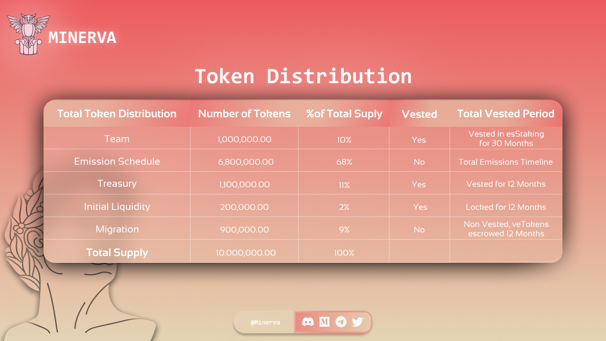

# 🗺 Overview

[MINE](mine.md) is the governance token of the platform, it is a regular ERC20 token that can be staked for rewards and earns earns ETH, allMINE, and Multiplier Points when staked.\
\
[allMINE](allmine.md) is the escrow token of the platform. It earns ETH, allMINE, and Multiplier Points when staked \
\
[MLP](mlp/) is the liquidity provider token of the platform, it can be minted using any of the tokens within the liquidity pool such as ETH, BTC, OP and USDC. The token’s price is determined by the worth of all tokens within the pool and factoring in the profits and losses of all currently opened positions. MLP earns ETH, allMINE, and is automatically staked on mint\
\
[**Multiplier Points**](../core-features/rewards.md#multiplier-points) boost ETH APRs when staked\
\
\
Minerva aims to have a sustainable emission schedule and proper emission management.\
\
The tokenomics were designed to have a maximum cap of $MINE tokens, so scarcity is a major player in controlling the supply and demand of the $MINE tokens.\
\
MINE Token Supply is limited to **10,000,000**. Meaning no more tokens will be minted. This way we have split the token emission between the migration and [Minerva](http://minerva.money/).\
\
Check the allocations table below for Minerva:

<figure><figcaption></figcaption></figure>

